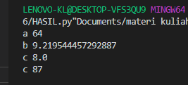

# Tugas pertemuan ke 9
Repository ini digunakan untuk memenuhi Tugas Bahasa Pemrograman - Pertemuan 9

Nama    : Dani Darmawan <br>
NIM     : 312010154 <br>
KELAS   : TI.20.B1 <br>

### DAFTAR ISI
| NO | DESCRIPTION | LINK |
| ---- | ----- | ----|
| 1 | Latihan  | [CLICK HERE](#latihan) |
| 2 | Praktikum ke 6  | [CLICK HERE](#Praktikum_Ke_6) |

## Latihan
Latihan soal pada pertemeuan ke 10  <br> 
``` python
import math 
def a(x):
    print("a",x**2)

def b(x, y):
    print("b",math.sqrt(x**2 + y**2))

def c(*args):
    print("c",sum(args)/len(args))

def d(s):
    print("c","".join(set(s)))

```
Perintah untuk memanggil
``` python
from latihan import *
a(8)
b(6, 7)
c(8)
d('78')

```
Hasil <br>
<br>
Terdidir dari 2 file python yang satu untuk proses dan yang satunya lagu untuk mengakses<br>
agar kedua file tersebut dapat berhubungan kita menggunakan fungsi ***import (nama file yg ingin di AKSES)atau  from (nama file yg ingin di akses) import***


